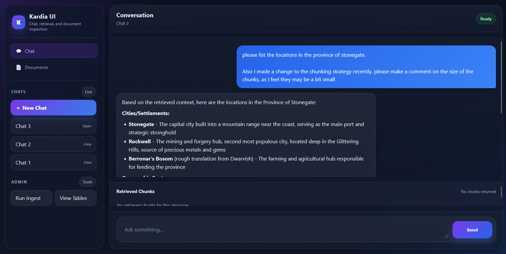

# Kardia
A RAG-Pipeline for Homebrew Content Generation



## What is This?
Back in 2022, as ChatGPT and other LLMs began to show potential, I started experimenting with an early RAG pipeline for homebrew content generation. Called Yggdrasil, or Yggy for short, the idea was to make an AI Game Master. You can find the code [here](https://github.com/crossjbeer/yggdrasil). 

As I built Yggy, I watched tools like Langchain and Llama-index grow up around me. I disheartendly expected my own ideas to be eaten by something larger, more quickly than I could build alone. You see that pessemism expressed on Yggy's short README. Now, a couple years further down the line, no such tool has emerged. Nothing is so usable and configurable as I would like it to be, so here I am again. Wahoo!

## Why Dungeons & Dragons? 
Because I play Dungeons & Dragons! I want to use this darn thing. 

Dnd represents an abstract, multi-faceted knowledge domain. It features obscure jargon, rules-based hierarchies, and a continuously updating corpus of knowledge. That's not too dissimilar from any other niche domain (biology, sociology, looksmaxxing, etc). While this system is tuned to homebrew TTRPG content generation, the core tenants of RAG-endowed Agentic AI hold across the board. Chunking, embedding, retrieval, and all accompanying technologies act agnostically. This project not only serves to demonstrate a basic understanding of these principals, but also how domain-expertise can improve overall RAG quality. 

## How to Use
Clone the repo and add your lore files (.txt, .md) to the folder called `lore`. Follow the tutorial below to produce a chat interface over your own files!

## Requirements 
### Docker
Docker Desktop is available for [Windows, Mac, and Linux](https://www.docker.com/products/docker-desktop/).

Alternatively, on Linux, you may use [Docker Engine](https://docs.docker.com/engine/install/) and the [Docker Compose plugin](https://docs.docker.com/compose/install/linux/).

#### Checking your install
```bash
docker --version
docker compose version
```

## Running
### Quick Start
```bash
git clone https://github.com/crossjbeer/kardia
cd kardia
## **Add your lore files (.txt, .md) to the lore folder**
docker compose up --build # remove --build on future runs
```

### Usage
Once running, open `http://localhost:8080`

This opens our web interface where you can run the ingestion pipeline, browse documents and chat! 

### Quick Stop
```bash
docker compose down 
```

## How it Works: 
Kardia is (currently) a text-based RAG pipeline built in Docker using PostgreSQL, Langgraph, and Llama-Index. 

### API
A **FastAPI** + **uvicorn** setup sits between the frontend and the following backend capabilities: 
1. Document ETL
2. Vector/Keyword/Hybrid Retrieval 
3. RAG-Equipped Chatting
4. Corpus Browsing / Editing

### Database 
The project uses **PostgreSQL 16** with the **pgvector** extension for embedding-based semantic retrieval and built-in **ts_rank** capabilities for keyword-based retrieval. I use postgres to demonstrate a production-adjacent environment. Simpler, light-weight solutions such as SQLite or an in-memory vector store are foregone to highlight scalability, indexing strategies, retrieval strategies, and integration with existing data infrastructure. 

#### Migrating
**Alembic** handles database migrations. Five version files exist: 
1. Register pgvector
2. Build tables
3. Create an embedding cosine similarity index 
4. Support keyword search 
5. Expanding Document Metadata

### Ingestion
I leverage **Llama-index** to build an ETL pipe for **text** and **markdown** files. I utilize a **Strategy-pattern** to organize individual document ingestion strategies and a **Registry** to serve them. This trivializes adding new ingestion strategies down the line. 

Documents are chunked into 512 character segments (the max supported by our embedding model) with a 64 character overlap. These settings can be configured in .env. 

This chunking style may prove limiting if we use keyword search more frequently. 

As of 2026-03-24, I am opting to keep the chunk size at 512 characters. 

As of 2026-03-25, I am feeling slightly limited by our chunking style. 512 characters is not a lot of information, for vector or keyword retrieval. While the vectors seem of high representative quality, more work is needed to fully exploit the info. Could grab chunks 'around' the high-ranking chunks to ensure coverage or upgrade to the bge-v3 model.

#### Embeddings
I embed using the `BAAI/bge-small-en-v1.5` model served up through huggingface. This produces a dimension 384 vector representing each 512 character chunk produced from lore. 

`bge-small-en-v1.5` is chosen for its size (33.4M params, 133 mb) and ability to run locally. While embedding through most major companies is relatively inexpensive, this model is chosen to demonstrate the capabilities of small, OOTB solutions on abstract domains. More information on these BGE models is available [here](https://bge-model.com/tutorial/1_Embedding/1.2.1.html). 

Embedding accuracy can be improved with larger BERT-based models (bge-base, bge-large) or through privately mainted, GPT-derived models like text-embedding-003 or cohere's embed-v4. 

### Retrieval 
Retrieval is also handled via **Strategy-pattern** and **Registry**.

Supported Retrieval Methods: 
1. Vector-based Top-k (cosine)
2. Keyword-based Top-k (ts_rank)
3. Hybrid Vector+Keyword Top-k (rrf)

While **vector-based top-k** retrieval is often seen as optimal for RAG pipelines, **keyword-based** is typically overlooked. Keyword search can prove particularly useful in this niche domain where specific nouns and names are prevalent. A hybrid recommender aims to bridge the gap, retrieving via embedding and keyword and comparing the results. 

### Chat
**Langgraph** handles the agentic chat approach. We build out a graph capable of loading chat history, retrieving context, and calling our LLM. **Langgraph** is chosen here for scalability and composability. While it is possible to simply query the Anthropic API (or any other LLM API) in our own framework, **Langgraph** most of the minutia and gets us to querying faster. 